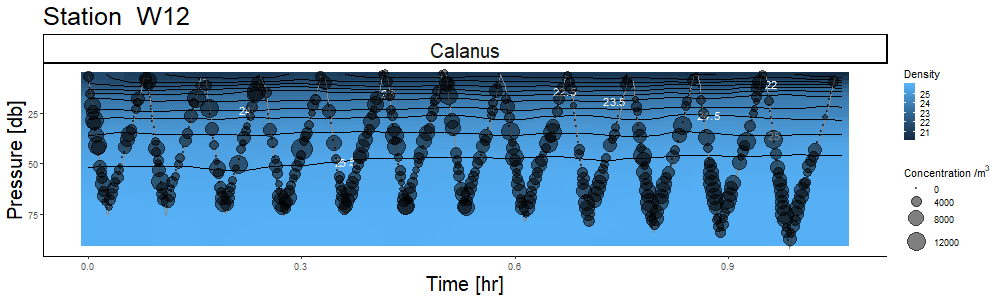

<!-- README.md is generated from README.Rmd. Please edit that file -->

# vprr <a href='https://dplyr.tidyverse.org'></a>


<!-- badges: start -->
<!-- badges: end -->

The goal of vprr is to process Video Plankton Recorder (VPR) data in R.
This package allows for manual classification of plankton images,
calculation of important ecological metrics such as concentration of
plankton, data visualization, and data output with self-contained
metadata.

Detailed information about vprr and its use can be found in the
VPR_processing vignette.

## Installation

You can install the released version of vprr from
[CRAN](https://CRAN.R-project.org) with:

``` r
install.packages("vprr")
```

And the development version from [GitHub](https://github.com/) with:

``` r
# install.packages("devtools")
devtools::install_github("EOGrady21/vprr")
```

## Details

vprr is designed to be used after processing VPR data with Visual
Plankton (VP), a Matlab image classification software. Although not
dependent on any specific elements of VP, the data processing is
designed around VP file formats and directory structures. Visual
Plankton code can be found: On GC code (for internal DFO users), within
the dfo-mar-odis group, and ‘visual plankton’ project. For permission to
view the project on GC code, contact
<DataServicesDonnees@dfo-mpo.gc.ca>.

All the technical details of vprr can be found in the package vignette,
available through Rstudio or at <https://eogrady21.github.io/vprr/>
(under Articles).


Figure 1. VPR data processing flow chart. Blue boxes represent software,
green and yellow boxes represent data sets, where yellow is visual data
and green is text format data. This package represents ‘Processing and
Visualization (R)’.

The first element of processing VPR data is to classify the images
collected. This can be done in VP (Visual Plankton - Matlab), using
machine learning techniques and then checked and manually edited in
vprr. vprr uses a GUI, called through `vpr_manual_classification()` to
allow a user to review and change image classifications.


Figure 2. A screenshot from the vprr manual reclassification process.
VPR images are displayed in the RStudio Viewer (right), prompts are
displayed in the RStudio console (left). Users are asked if VP
classifications are correct, if not, they are asked to select the proper
classification from a pre-set list of categories.

Once images have been properly classified, all data sources are
combined, in order to analyze data and calculate relevant environmental
metrics such as plankton concentration. Data from CTD files
(`vpr_ctd_read()`) and image classification (`vpr_autoid_read()`) can be
read in and combined into easy-to-use data frames. vprr can combine VPR
CTD, and VPR image classifications into depth bins, and calculate
concentration (`vpr_roi_concentration()`).

After data is processed, it can be visualized for easy interpretation.
Although this package does not focus on visualization, it does provide
some basic plotting functions for tow-yo VPR data
(`vpr_plot_contour()`).



Figure 3. An example of visualization of VPR data showing calculated
concentration of Calanus along the VPR tow-yo path, over density
contours.
